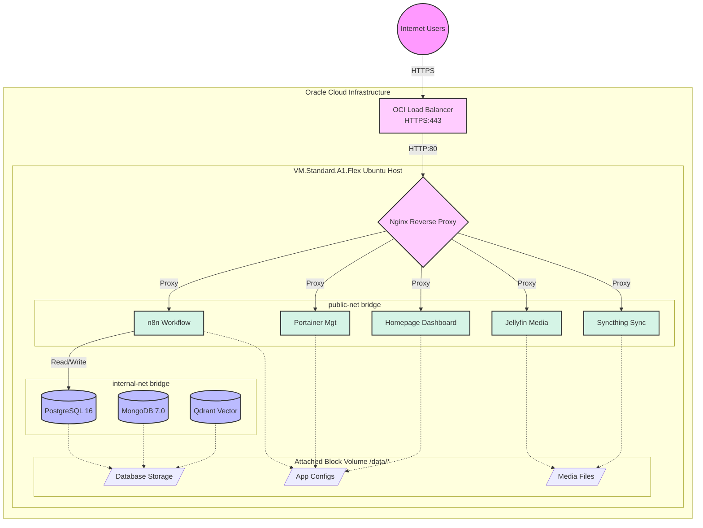

# Oracle Cloud Homelab — Server Setup


Production-ready deployment kit for a self-hosted homelab on **Oracle Free Tier** (`VM.Standard.A1.Flex` — 4 ARM OCPUs, 24 GB RAM, 200 GB Storage).

## What's Included

| Service        | Purpose                      | Subdomain                  |
| -------------- | ---------------------------- | -------------------------- |
| **Nginx**      | Reverse proxy + static sites | `yourdomain.com`           |
| **N8N**        | Workflow automation          | `n8n.yourdomain.com`       |
| **Portainer**  | Container management         | `portainer.yourdomain.com` |
| **Homepage**   | Dashboard                    | `home.yourdomain.com`      |
| **Jellyfin**   | Music streaming              | `media.yourdomain.com`     |
| **Syncthing**  | Phone-to-server file sync    | `sync.yourdomain.com`      |
| **PostgreSQL** | Relational database          | Internal only              |
| **MongoDB**    | Document database            | Internal only              |
| **Qdrant**     | Vector database              | Internal only              |

## Project Structure

```
Server-Setup/
├── Setup.md                    # Architecture plan (reference)
├── Deployment-Guide.md         # Step-by-step deployment guide
├── docker-compose.yml          # All 9 containers
├── .env                        # Secrets template (⚠ fill before deploy)
├── daemon.json                 # Docker daemon config → /etc/docker/daemon.json
├── nginx/
│   ├── nginx.conf              # Main Nginx config → /data/nginx/nginx.conf
│   └── conf.d/
│       ├── health.conf         # OCI LB health endpoint + catch-all
│       ├── n8n.conf            # n8n reverse proxy
│       ├── portainer.conf      # Portainer reverse proxy
│       ├── homepage.conf       # Homepage reverse proxy
│       ├── jellyfin.conf       # Jellyfin reverse proxy
│       ├── syncthing.conf      # Syncthing reverse proxy
│       └── portfolio.conf      # Static site server block
├── postgres-init/
│   └── init-databases.sql      # Creates n8n_backend & project_data DBs
├── homepage/
│   ├── services.yaml           # Dashboard service definitions
│   ├── settings.yaml           # Theme & layout settings
│   └── docker.yaml             # Docker socket integration
├── scripts/
│   └── backup-data-volume.sh   # Automated OCI block volume backup
├── websites/
│   └── index.html              # Placeholder landing page
├── .gitignore                  # Prevents .env from being committed
└── README.md                   # This file
```

## The Complete Beginner's Handbook

This project features a comprehensive [**Beginner's Handbook**](Deployment-Guide.md) that explains everything from scratch, assuming zero prior cloud experience. In the guide, you'll learn to:

- Create your absolutely free Oracle VM, Network, and 150GB external data drive
- Configure maximum security **Bastion Access** (Zero SSH public exposure)
- Mount storage, optimize the OS kernel, and configure a 6GB swap file
- Deploy automated weekly backups to protect your hard drive
- Secure the setup with an Oracle Load Balancer and HTTPS
- Configure 9 essential self-hosted containers on custom internal/public networks

---

## Quick Start

1. **Read** the [Beginner's Handbook (`Deployment-Guide.md`)](Deployment-Guide.md) – start here and follow every phase in order.
2. **Fill in** `.env` with your secure passwords and generated keys.
3. **Replace** `yourdomain.com` in all Nginx configs and `.env` with your actual domain.
4. **Copy** files to the server at `/data/` and deploy with `docker compose up -d`.

## Security & Performance Notes

- **Secrets:** `.env` contains all credentials — **never commit it** (already in `.gitignore`).
- **Isolation:** Databases are strictly isolated on a Docker network (`internal-net`) with zero internet access.
- **VCN Firewall:** Port 80 is strictly restricted to the OCI Load Balancer's subnet via VCN Security List.
- **Bastion SSH:** SSH access requires OCI Managed Bastion authentication — port 22 is completely blocked natively.
- **Storage Protection:** A dedicated 150GB volume ensures data outlives the boot drive, complete with automated cron backups.
- **Resource Limits:** Hard-coded container memory limits (`mem_limit`) ensure the 24GB RAM VM remains perfectly stable under load.

## Architecture



## License

Private — personal homelab configuration.
